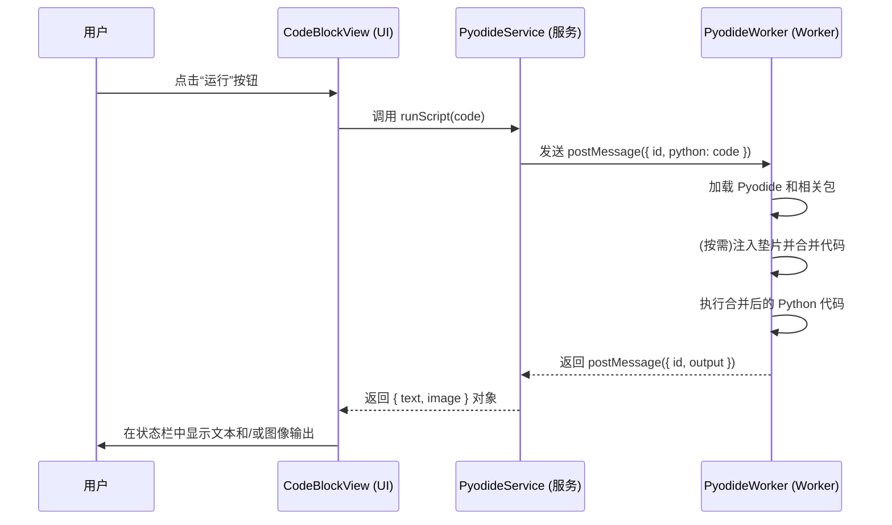
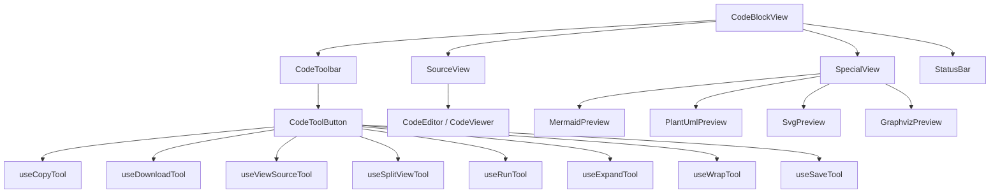
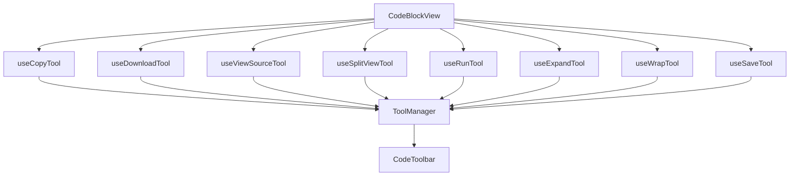
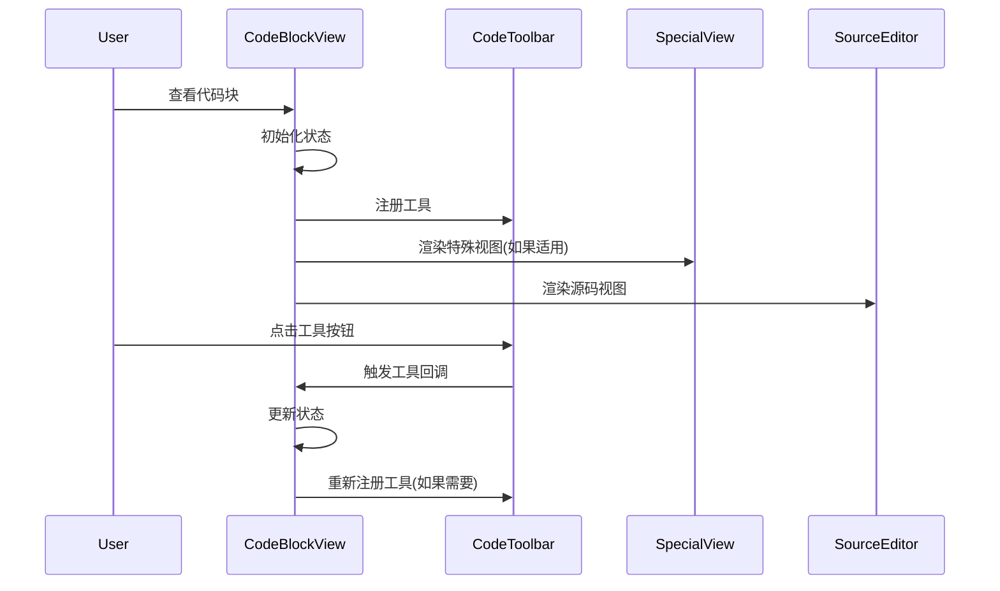
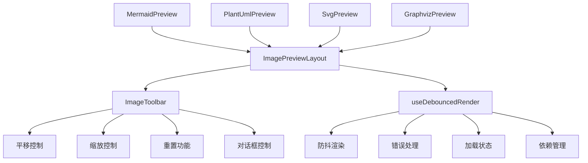

<div align="right" >
  <details>
    <summary >🌐 Language</summary>
    <div>
      <div align="right">
        <p><a href="https://openaitx.github.io/view.html?user=CherryHQ&project=cherry-studio&lang=en">English</a></p>
        <p><a href="https://openaitx.github.io/view.html?user=CherryHQ&project=cherry-studio&lang=zh-CN">简体中文</a></p>
        <p><a href="https://openaitx.github.io/view.html?user=CherryHQ&project=cherry-studio&lang=zh-TW">繁體中文</a></p>
        <p><a href="https://openaitx.github.io/view.html?user=CherryHQ&project=cherry-studio&lang=ja">日本語</a></p>
        <p><a href="https://openaitx.github.io/view.html?user=CherryHQ&project=cherry-studio&lang=ko">한국어</a></p>
        <p><a href="https://openaitx.github.io/view.html?user=CherryHQ&project=cherry-studio&lang=hi">हिन्दी</a></p>
        <p><a href="https://openaitx.github.io/view.html?user=CherryHQ&project=cherry-studio&lang=th">ไทย</a></p>
        <p><a href="https://openaitx.github.io/view.html?user=CherryHQ&project=cherry-studio&lang=fr">Français</a></p>
        <p><a href="https://openaitx.github.io/view.html?user=CherryHQ&project=cherry-studio&lang=de">Deutsch</a></p>
        <p><a href="https://openaitx.github.io/view.html?user=CherryHQ&project=cherry-studio&lang=es">Español</a></p>
        <p><a href="https://openaitx.github.io/view.html?user=CherryHQ&project=cherry-studio&lang=it">Italiano</a></p>
        <p><a href="https://openaitx.github.io/view.html?user=CherryHQ&project=cherry-studio&lang=ru">Русский</a></p>
        <p><a href="https://openaitx.github.io/view.html?user=CherryHQ&project=cherry-studio&lang=pt">Português</a></p>
        <p><a href="https://openaitx.github.io/view.html?user=CherryHQ&project=cherry-studio&lang=nl">Nederlands</a></p>
        <p><a href="https://openaitx.github.io/view.html?user=CherryHQ&project=cherry-studio&lang=pl">Polski</a></p>
        <p><a href="https://openaitx.github.io/view.html?user=CherryHQ&project=cherry-studio&lang=ar">العربية</a></p>
        <p><a href="https://openaitx.github.io/view.html?user=CherryHQ&project=cherry-studio&lang=fa">فارسی</a></p>
        <p><a href="https://openaitx.github.io/view.html?user=CherryHQ&project=cherry-studio&lang=tr">Türkçe</a></p>
        <p><a href="https://openaitx.github.io/view.html?user=CherryHQ&project=cherry-studio&lang=vi">Tiếng Việt</a></p>
        <p><a href="https://openaitx.github.io/view.html?user=CherryHQ&project=cherry-studio&lang=id">Bahasa Indonesia</a></p>
      </div>
    </div>
  </details>
</div>

<h1 align="center">
  <a href="https://github.com/CherryHQ/cherry-studio/releases">
    <br>
  </a>
</h1>

<p align="center">English | <a href="./docs/zh/README.md">中文</a> | <a href="https://cherry-ai.com">Official Site</a> | <a href="https://docs.cherry-ai.com/docs/en-us">Documents</a> | <a href="./docs/en/guides/development.md">Development</a> | <a href="https://github.com/CherryHQ/cherry-studio/issues">Feedback</a><br></p>

<div align="center">

[![][deepwiki-shield]][deepwiki-link]
[![][twitter-shield]][twitter-link]
[![][discord-shield]][discord-link]
[![][telegram-shield]][telegram-link]

</div>
<div align="center">

[![][github-release-shield]][github-release-link]
[![][github-nightly-shield]][github-nightly-link]
[![][github-contributors-shield]][github-contributors-link]
[![][license-shield]][license-link]
[![][commercial-shield]][commercial-link]
[![][sponsor-shield]][sponsor-link]

</div>

<div align="center">
 <a href="https://hellogithub.com/repository/1605492e1e2a4df3be07abfa4578dd37" target="_blank" style="text-decoration: none"></a>
 <a href="https://trendshift.io/repositories/14318" target="_blank" style="text-decoration: none"></a>
 <a href="https://www.producthunt.com/posts/cherry-studio?embed=true&utm_source=badge-featured&utm_medium=badge&utm_souce=badge-cherry&#0045;studio" target="_blank"></a>
</div>

# 🍒 Cherry Studio

Cherry Studio is a desktop client that supports multiple LLM providers, available on Windows, Mac and Linux.

👏 Join [Telegram Group](https://t.me/CherryStudioAI)｜[Discord](https://discord.gg/wez8HtpxqQ) | [QQ Group(575014769)](https://qm.qq.com/q/lo0D4qVZKi)

❤️ Like Cherry Studio? Give it a star 🌟 or [Sponsor](docs/zh/guides/sponsor.md) to support the development!

# 🌠 Screenshot


# 🌟 Key Features

1. **Diverse LLM Provider Support**:

- ☁️ Major LLM Cloud Services: OpenAI, Gemini, Anthropic, and more
- 🔗 AI Web Service Integration: Claude, Perplexity, [Poe](https://poe.com/), and others
- 💻 Local Model Support with Ollama, LM Studio

2. **AI Assistants & Conversations**:

- 📚 300+ Pre-configured AI Assistants
- 🤖 Custom Assistant Creation
- 💬 Multi-model Simultaneous Conversations

3. **Document & Data Processing**:

- 📄 Supports Text, Images, Office, PDF, and more
- ☁️ WebDAV File Management and Backup
- 📊 Mermaid Chart Visualization
- 💻 Code Syntax Highlighting

4. **Practical Tools Integration**:

- 🔍 Global Search Functionality
- 📝 Topic Management System
- 🔤 AI-powered Translation
- 🎯 Drag-and-drop Sorting
- 🔌 Mini Program Support
- ⚙️ MCP(Model Context Protocol) Server

5. **Enhanced User Experience**:

- 🖥️ Cross-platform Support for Windows, Mac, and Linux
- 📦 Ready to Use - No Environment Setup Required
- 🎨 Light/Dark Themes and Transparent Window
- 📝 Complete Markdown Rendering
- 🤲 Easy Content Sharing

# 📝 Roadmap

We're actively working on the following features and improvements:

1. 🎯 **Core Features**

- Selection Assistant with smart content selection enhancement
- Deep Research with advanced research capabilities
- Memory System with global context awareness
- Document Preprocessing with improved document handling
- MCP Marketplace for Model Context Protocol ecosystem

2. 🗂 **Knowledge Management**

- Notes and Collections
- Dynamic Canvas visualization
- OCR capabilities
- TTS (Text-to-Speech) support

3. 📱 **Platform Support**

- HarmonyOS Edition (PC)
- Android App (Phase 1)
- iOS App (Phase 1)
- Multi-Window support
- Window Pinning functionality
- Intel AI PC (Core Ultra) Support

4. 🔌 **Advanced Features**

- Plugin System
- ASR (Automatic Speech Recognition)
- Assistant and Topic Interaction Refactoring

Track our progress and contribute on our [project board](https://github.com/orgs/CherryHQ/projects/7).

Want to influence our roadmap? Join our [GitHub Discussions](https://github.com/CherryHQ/cherry-studio/discussions) to share your ideas and feedback!

# 🌈 Theme

- Theme Gallery: <https://cherrycss.com>
- Aero Theme: <https://github.com/hakadao/CherryStudio-Aero>
- PaperMaterial Theme: <https://github.com/rainoffallingstar/CherryStudio-PaperMaterial>
- Claude dynamic-style: <https://github.com/bjl101501/CherryStudio-Claudestyle-dynamic>
- Maple Neon Theme: <https://github.com/BoningtonChen/CherryStudio_themes>

Welcome PR for more themes


# 🔗 Related Projects

- [new-api](https://github.com/QuantumNous/new-api): The next-generation LLM gateway and AI asset management system supports multiple languages.

- [one-api](https://github.com/songquanpeng/one-api): LLM API management and distribution system supporting mainstream models like OpenAI, Azure, and Anthropic. Features a unified API interface, suitable for key management and secondary distribution.

- [Poe](https://poe.com/): Poe gives you access to the best AI, all in one place. Explore GPT-5, Claude Opus 4.1, DeepSeek-R1, Veo 3, ElevenLabs, and millions of others.

- [ublacklist](https://github.com/iorate/ublacklist): Blocks specific sites from appearing in Google search results

# 🚀 Contributors

<a href="https://github.com/CherryHQ/cherry-studio/graphs/contributors">
  
</a>
<br /><br />


# 消息系统

本文档介绍 Cherry Studio 的消息系统架构，包括消息生命周期、状态管理和操作接口。

## 消息的生命周期


---

# messageBlock.ts 使用指南

该文件定义了用于管理应用程序中所有 `MessageBlock` 实体的 Redux Slice。它使用 Redux Toolkit 的 `createSlice` 和 `createEntityAdapter` 来高效地处理规范化的状态，并提供了一系列 actions 和 selectors 用于与消息块数据交互。

## 核心目标

- **状态管理**: 集中管理所有 `MessageBlock` 的状态。`MessageBlock` 代表消息中的不同内容单元（如文本、代码、图片、引用等）。
- **规范化**: 使用 `createEntityAdapter` 将 `MessageBlock` 数据存储在规范化的结构中（`{ ids: [], entities: {} }`），这有助于提高性能和简化更新逻辑。
- **可预测性**: 提供明确的 actions 来修改状态，并通过 selectors 安全地访问状态。

## 关键概念

- **Slice (`createSlice`)**: Redux Toolkit 的核心 API，用于创建包含 reducer 逻辑、action creators 和初始状态的 Redux 模块。
- **Entity Adapter (`createEntityAdapter`)**: Redux Toolkit 提供的工具，用于简化对规范化数据的 CRUD（创建、读取、更新、删除）操作。它会自动生成 reducer 函数和 selectors。
- **Selectors**: 用于从 Redux store 中派生和计算数据的函数。Selectors 可以被记忆化（memoized），以提高性能。

## State 结构

`messageBlocks` slice 的状态结构由 `createEntityAdapter` 定义，大致如下：

```typescript
{
  ids: string[]; // 存储所有 MessageBlock ID 的有序列表
  entities: { [id: string]: MessageBlock }; // 按 ID 存储 MessageBlock 对象的字典
  loadingState: 'idle' | 'loading' | 'succeeded' | 'failed'; // (可选) 其他状态，如加载状态
  error: string | null; // (可选) 错误信息
}
```

## Actions

该 slice 导出以下 actions (由 `createSlice` 和 `createEntityAdapter` 自动生成或自定义)：

- **`upsertOneBlock(payload: MessageBlock)`**:

  - 添加一个新的 `MessageBlock` 或更新一个已存在的 `MessageBlock`。如果 payload 中的 `id` 已存在，则执行更新；否则执行插入。

- **`upsertManyBlocks(payload: MessageBlock[])`**:

  - 添加或更新多个 `MessageBlock`。常用于批量加载数据（例如，加载一个 Topic 的所有消息块）。

- **`removeOneBlock(payload: string)`**:

  - 根据提供的 `id` (payload) 移除单个 `MessageBlock`。

- **`removeManyBlocks(payload: string[])`**:

  - 根据提供的 `id` 数组 (payload) 移除多个 `MessageBlock`。常用于删除消息或清空 Topic 时清理相关的块。

- **`removeAllBlocks()`**:

  - 移除 state 中的所有 `MessageBlock` 实体。

- **`updateOneBlock(payload: { id: string; changes: Partial<MessageBlock> })`**:

  - 更新一个已存在的 `MessageBlock`。`payload` 需要包含块的 `id` 和一个包含要更改的字段的 `changes` 对象。

- **`setMessageBlocksLoading(payload: 'idle' | 'loading')`**:

  - (自定义) 设置 `loadingState` 属性。

- **`setMessageBlocksError(payload: string)`**:
  - (自定义) 设置 `loadingState` 为 `'failed'` 并记录错误信息。

**使用示例 (在 Thunk 或其他 Dispatch 的地方):**

```typescript
import { upsertOneBlock, removeManyBlocks, updateOneBlock } from './messageBlock'
import store from './store' // 假设这是你的 Redux store 实例

// 添加或更新一个块
const newBlock: MessageBlock = {
  /* ... block data ... */
}
store.dispatch(upsertOneBlock(newBlock))

// 更新一个块的内容
store.dispatch(updateOneBlock({ id: blockId, changes: { content: 'New content' } }))

// 删除多个块
const blockIdsToRemove = ['id1', 'id2']
store.dispatch(removeManyBlocks(blockIdsToRemove))
```

## Selectors

该 slice 导出由 `createEntityAdapter` 生成的基础 selectors，并通过 `messageBlocksSelectors` 对象访问：

- **`messageBlocksSelectors.selectIds(state: RootState): string[]`**: 返回包含所有块 ID 的数组。
- **`messageBlocksSelectors.selectEntities(state: RootState): { [id: string]: MessageBlock }`**: 返回块 ID 到块对象的映射字典。
- **`messageBlocksSelectors.selectAll(state: RootState): MessageBlock[]`**: 返回包含所有块对象的数组。
- **`messageBlocksSelectors.selectTotal(state: RootState): number`**: 返回块的总数。
- **`messageBlocksSelectors.selectById(state: RootState, id: string): MessageBlock | undefined`**: 根据 ID 返回单个块对象，如果找不到则返回 `undefined`。

**此外，还提供了一个自定义的、记忆化的 selector：**

- **`selectFormattedCitationsByBlockId(state: RootState, blockId: string | undefined): Citation[]`**:
  - 接收一个 `blockId`。
  - 如果该 ID 对应的块是 `CITATION` 类型，则提取并格式化其包含的引用信息（来自网页搜索、知识库等），进行去重和重新编号，最后返回一个 `Citation[]` 数组，用于在 UI 中显示。
  - 如果块不存在或类型不匹配，返回空数组 `[]`。
  - 这个 selector 封装了处理不同引用来源（Gemini, OpenAI, OpenRouter, Zhipu 等）的复杂逻辑。

**使用示例 (在 React 组件或 `useSelector` 中):**

```typescript
import { useSelector } from 'react-redux'
import { messageBlocksSelectors, selectFormattedCitationsByBlockId } from './messageBlock'
import type { RootState } from './store'

// 获取所有块
const allBlocks = useSelector(messageBlocksSelectors.selectAll)

// 获取特定 ID 的块
const specificBlock = useSelector((state: RootState) => messageBlocksSelectors.selectById(state, someBlockId))

// 获取特定引用块格式化后的引用列表
const formattedCitations = useSelector((state: RootState) => selectFormattedCitationsByBlockId(state, citationBlockId))

// 在组件中使用引用数据
// {formattedCitations.map(citation => ...)}
```

## 集成

`messageBlock.ts` slice 通常与 `messageThunk.ts` 中的 Thunks 紧密协作。Thunks 负责处理异步逻辑（如 API 调用、数据库操作），并在需要时 dispatch `messageBlock` slice 的 actions 来更新状态。例如，当 `messageThunk` 接收到流式响应时，它会 dispatch `upsertOneBlock` 或 `updateOneBlock` 来实时更新对应的 `MessageBlock`。同样，删除消息的 Thunk 会 dispatch `removeManyBlocks`。

理解 `messageBlock.ts` 的职责是管理**状态本身**，而 `messageThunk.ts` 负责**触发状态变更**的异步流程，这对于维护清晰的应用架构至关重要。

---

# messageThunk.ts 使用指南

该文件包含用于管理应用程序中消息流、处理助手交互以及同步 Redux 状态与 IndexedDB 数据库的核心 Thunk Action Creators。主要围绕 `Message` 和 `MessageBlock` 对象进行操作。

## 核心功能

1.  **发送/接收消息**: 处理用户消息的发送，触发助手响应，并流式处理返回的数据，将其解析为不同的 `MessageBlock`。
2.  **状态管理**: 确保 Redux store 中的消息和消息块状态与 IndexedDB 中的持久化数据保持一致。
3.  **消息操作**: 提供删除、重发、重新生成、编辑后重发、追加响应、克隆等消息生命周期管理功能。
4.  **Block 处理**: 动态创建、更新和保存各种类型的 `MessageBlock`（文本、思考过程、工具调用、引用、图片、错误、翻译等）。

## 主要 Thunks

以下是一些关键的 Thunk 函数及其用途：

1.  **`sendMessage(userMessage, userMessageBlocks, assistant, topicId)`**

    - **用途**: 发送一条新的用户消息。
    - **流程**:
      - 保存用户消息 (`userMessage`) 及其块 (`userMessageBlocks`) 到 Redux 和 DB。
      - 检查 `@mentions` 以确定是单模型响应还是多模型响应。
      - 创建助手消息(们)的存根 (Stub)。
      - 将存根添加到 Redux 和 DB。
      - 将核心处理逻辑 `fetchAndProcessAssistantResponseImpl` 添加到该 `topicId` 的队列中以获取实际响应。
    - **Block 相关**: 主要处理用户消息的初始 `MessageBlock` 保存。

2.  **`fetchAndProcessAssistantResponseImpl(dispatch, getState, topicId, assistant, assistantMessage)`**

    - **用途**: (内部函数) 获取并处理单个助手响应的核心逻辑，被 `sendMessage`, `resend...`, `regenerate...`, `append...` 等调用。
    - **流程**:
      - 设置 Topic 加载状态。
      - 准备上下文消息。
      - 调用 `fetchChatCompletion` API 服务。
      - 使用 `createStreamProcessor` 处理流式响应。
      - 通过各种回调 (`onTextChunk`, `onThinkingChunk`, `onToolCallComplete`, `onImageGenerated`, `onError`, `onComplete` 等) 处理不同类型的事件。
    - **Block 相关**:
      - 根据流事件创建初始 `UNKNOWN` 块。
      - 实时创建和更新 `MAIN_TEXT` 和 `THINKING` 块，使用 `throttledBlockUpdate` 和 `throttledBlockDbUpdate` 进行节流更新。
      - 创建 `TOOL`, `CITATION`, `IMAGE`, `ERROR` 等类型的块。
      - 在事件完成时（如 `onTextComplete`, `onToolCallComplete`）将块状态标记为 `SUCCESS` 或 `ERROR`，并使用 `saveUpdatedBlockToDB` 保存最终状态。
      - 使用 `handleBlockTransition` 管理非流式块（如 `TOOL`, `CITATION`）的添加和状态更新。

3.  **`loadTopicMessagesThunk(topicId, forceReload)`**

    - **用途**: 从数据库加载指定主题的所有消息及其关联的 `MessageBlock`。
    - **流程**:
      - 从 DB 获取 `Topic` 及其 `messages` 列表。
      - 根据消息 ID 列表从 DB 获取所有相关的 `MessageBlock`。
      - 使用 `upsertManyBlocks` 将块更新到 Redux。
      - 将消息更新到 Redux。
    - **Block 相关**: 负责将持久化的 `MessageBlock` 加载到 Redux 状态。

4.  **删除 Thunks**

    - `deleteSingleMessageThunk(topicId, messageId)`: 删除单个消息及其所有 `MessageBlock`。
    - `deleteMessageGroupThunk(topicId, askId)`: 删除一个用户消息及其所有相关的助手响应消息和它们的所有 `MessageBlock`。
    - `clearTopicMessagesThunk(topicId)`: 清空主题下的所有消息及其所有 `MessageBlock`。
    - **Block 相关**: 从 Redux 和 DB 中移除指定的 `MessageBlock`。

5.  **重发/重新生成 Thunks**

    - `resendMessageThunk(topicId, userMessageToResend, assistant)`: 重发用户消息。会重置（清空 Block 并标记为 PENDING）所有与该用户消息关联的助手响应，然后重新请求生成。
    - `resendUserMessageWithEditThunk(topicId, originalMessage, mainTextBlockId, editedContent, assistant)`: 用户编辑消息内容后重发。先更新用户消息的 `MAIN_TEXT` 块内容，然后调用 `resendMessageThunk`。
    - `regenerateAssistantResponseThunk(topicId, assistantMessageToRegenerate, assistant)`: 重新生成单个助手响应。重置该助手消息（清空 Block 并标记为 PENDING），然后重新请求生成。
    - **Block 相关**: 删除旧的 `MessageBlock`，并在重新生成过程中创建新的 `MessageBlock`。

6.  **`appendAssistantResponseThunk(topicId, existingAssistantMessageId, newModel, assistant)`**

    - **用途**: 在已有的对话上下文中，针对同一个用户问题，使用新选择的模型追加一个新的助手响应。
    - **流程**:
      - 找到现有助手消息以获取原始 `askId`。
      - 创建使用 `newModel` 的新助手消息存根（使用相同的 `askId`）。
      - 添加新存根到 Redux 和 DB。
      - 将 `fetchAndProcessAssistantResponseImpl` 添加到队列以生成新响应。
    - **Block 相关**: 为新的助手响应创建全新的 `MessageBlock`。

7.  **`cloneMessagesToNewTopicThunk(sourceTopicId, branchPointIndex, newTopic)`**

    - **用途**: 将源主题的部分消息（及其 Block）克隆到一个**已存在**的新主题中。
    - **流程**:
      - 复制指定索引前的消息。
      - 为所有克隆的消息和 Block 生成新的 UUID。
      - 正确映射克隆消息之间的 `askId` 关系。
      - 复制 `MessageBlock` 内容，更新其 `messageId` 指向新的消息 ID。
      - 更新文件引用计数（如果 Block 是文件或图片）。
      - 将克隆的消息和 Block 保存到新主题的 Redux 状态和 DB 中。
    - **Block 相关**: 创建 `MessageBlock` 的副本，并更新其 ID 和 `messageId`。

8.  **`initiateTranslationThunk(messageId, topicId, targetLanguage, sourceBlockId?, sourceLanguage?)`**
    - **用途**: 为指定消息启动翻译流程，创建一个初始的 `TRANSLATION` 类型的 `MessageBlock`。
    - **流程**:
      - 创建一个状态为 `STREAMING` 的 `TranslationMessageBlock`。
      - 将其添加到 Redux 和 DB。
      - 更新原消息的 `blocks` 列表以包含新的翻译块 ID。
    - **Block 相关**: 创建并保存一个占位的 `TranslationMessageBlock`。实际翻译内容的获取和填充需要后续步骤。

## 内部机制和注意事项

- **数据库交互**: 通过 `saveMessageAndBlocksToDB`, `updateExistingMessageAndBlocksInDB`, `saveUpdatesToDB`, `saveUpdatedBlockToDB`, `throttledBlockDbUpdate` 等辅助函数与 IndexedDB (`db`) 交互，确保数据持久化。
- **状态同步**: Thunks 负责协调 Redux Store 和 IndexedDB 之间的数据一致性。
- **队列 (`getTopicQueue`)**: 使用 `AsyncQueue` 确保对同一主题的操作（尤其是 API 请求）按顺序执行，避免竞态条件。
- **节流 (`throttle`)**: 对流式响应中频繁的 Block 更新（文本、思考）使用 `lodash.throttle` 优化性能，减少 Redux dispatch 和 DB 写入次数。
- **错误处理**: `fetchAndProcessAssistantResponseImpl` 内的回调函数（特别是 `onError`）处理流处理和 API 调用中可能出现的错误，并创建 `ERROR` 类型的 `MessageBlock`。

开发者在使用这些 Thunks 时，通常需要提供 `dispatch`, `getState` (由 Redux Thunk 中间件注入)，以及如 `topicId`, `assistant` 配置对象, 相关的 `Message` 或 `MessageBlock` 对象/ID 等参数。理解每个 Thunk 的职责和它如何影响消息及块的状态至关重要。

---

# useMessageOperations.ts 使用指南

该文件定义了一个名为 `useMessageOperations` 的自定义 React Hook。这个 Hook 的主要目的是为 React 组件提供一个便捷的接口，用于执行与特定主题（Topic）相关的各种消息操作。它封装了调用 Redux Thunks (`messageThunk.ts`) 和 Actions (`newMessage.ts`, `messageBlock.ts`) 的逻辑，简化了组件与消息数据交互的代码。

## 核心目标

- **封装**: 将复杂的消息操作逻辑（如删除、重发、重新生成、编辑、翻译等）封装在易于使用的函数中。
- **简化**: 让组件可以直接调用这些操作函数，而无需直接与 Redux `dispatch` 或 Thunks 交互。
- **上下文关联**: 所有操作都与传入的 `topic` 对象相关联，确保操作作用于正确的主题。

## 如何使用

在你的 React 函数组件中，导入并调用 `useMessageOperations` Hook，并传入当前活动的 `Topic` 对象。

```typescript
import React from 'react';
import { useMessageOperations } from '@renderer/hooks/useMessageOperations';
import type { Topic, Message, Assistant, Model } from '@renderer/types';

interface MyComponentProps {
  currentTopic: Topic;
  currentAssistant: Assistant;
}

function MyComponent({ currentTopic, currentAssistant }: MyComponentProps) {
  const {
    deleteMessage,
    resendMessage,
    regenerateAssistantMessage,
    appendAssistantResponse,
    getTranslationUpdater,
    createTopicBranch,
    // ... 其他操作函数
  } = useMessageOperations(currentTopic);

  const handleDelete = (messageId: string) => {
    deleteMessage(messageId);
  };

  const handleResend = (message: Message) => {
    resendMessage(message, currentAssistant);
  };

  const handleAppend = (existingMsg: Message, newModel: Model) => {
    appendAssistantResponse(existingMsg, newModel, currentAssistant);
  }

  // ... 在组件中使用其他操作函数

  return (
    <div>
      {/* Component UI */}
      <button onClick={() => handleDelete('some-message-id')}>Delete Message</button>
      {/* ... */}
    </div>
  );
}
```

## 返回值

`useMessageOperations(topic)` Hook 返回一个包含以下函数和值的对象：

- **`deleteMessage(id: string)`**:

  - 删除指定 `id` 的单个消息。
  - 内部调用 `deleteSingleMessageThunk`。

- **`deleteGroupMessages(askId: string)`**:

  - 删除与指定 `askId` 相关联的一组消息（通常是用户提问及其所有助手回答）。
  - 内部调用 `deleteMessageGroupThunk`。

- **`editMessage(messageId: string, updates: Partial<Message>)`**:

  - 更新指定 `messageId` 的消息的部分属性。
  - **注意**: 目前主要用于更新 Redux 状态
  - 内部调用 `newMessagesActions.updateMessage`。

- **`resendMessage(message: Message, assistant: Assistant)`**:

  - 重新发送指定的用户消息 (`message`)，这将触发其所有关联助手响应的重新生成。
  - 内部调用 `resendMessageThunk`。

- **`resendUserMessageWithEdit(message: Message, editedContent: string, assistant: Assistant)`**:

  - 在用户消息的主要文本块被编辑后，重新发送该消息。
  - 会先查找消息的 `MAIN_TEXT` 块 ID，然后调用 `resendUserMessageWithEditThunk`。

- **`clearTopicMessages(_topicId?: string)`**:

  - 清除当前主题（或可选的指定 `_topicId`）下的所有消息。
  - 内部调用 `clearTopicMessagesThunk`。

- **`createNewContext()`**:

  - 发出一个全局事件 (`EVENT_NAMES.NEW_CONTEXT`)，通常用于通知 UI 清空显示，准备新的上下文。不直接修改 Redux 状态。

- **`displayCount`**:

  - (非操作函数) 从 Redux store 中获取当前的 `displayCount` 值。

- **`pauseMessages()`**:

  - 尝试中止当前主题中正在进行的消息生成（状态为 `processing` 或 `pending`）。
  - 通过查找相关的 `askId` 并调用 `abortCompletion` 来实现。
  - 同时会 dispatch `setTopicLoading` action 将加载状态设为 `false`。

- **`resumeMessage(message: Message, assistant: Assistant)`**:

  - 恢复/重新发送一个用户消息。目前实现为直接调用 `resendMessage`。

- **`regenerateAssistantMessage(message: Message, assistant: Assistant)`**:

  - 重新生成指定的**助手**消息 (`message`) 的响应。
  - 内部调用 `regenerateAssistantResponseThunk`。

- **`appendAssistantResponse(existingAssistantMessage: Message, newModel: Model, assistant: Assistant)`**:

  - 针对 `existingAssistantMessage` 所回复的**同一用户提问**，使用 `newModel` 追加一个新的助手响应。
  - 内部调用 `appendAssistantResponseThunk`。

- **`getTranslationUpdater(messageId: string, targetLanguage: string, sourceBlockId?: string, sourceLanguage?: string)`**:

  - **用途**: 获取一个用于逐步更新翻译块内容的函数。
  - **流程**:
    1.  内部调用 `initiateTranslationThunk` 来创建或获取一个 `TRANSLATION` 类型的 `MessageBlock`，并获取其 `blockId`。
    2.  返回一个**异步更新函数**。
  - **返回的更新函数 `(accumulatedText: string, isComplete?: boolean) => void`**:
    - 接收累积的翻译文本和完成状态。
    - 调用 `updateOneBlock` 更新 Redux 中的翻译块内容和状态 (`STREAMING` 或 `SUCCESS`)。
    - 调用 `throttledBlockDbUpdate` 将更新（节流地）保存到数据库。
  - 如果初始化失败（Thunk 返回 `undefined`），则此函数返回 `null`。

- **`createTopicBranch(sourceTopicId: string, branchPointIndex: number, newTopic: Topic)`**:
  - 创建一个主题分支，将 `sourceTopicId` 主题中 `branchPointIndex` 索引之前的消息克隆到 `newTopic` 中。
  - **注意**: `newTopic` 对象必须是调用此函数**之前**已经创建并添加到 Redux 和数据库中的。
  - 内部调用 `cloneMessagesToNewTopicThunk`。

## 依赖

- **`topic: Topic`**: 必须传入当前操作上下文的主题对象。Hook 返回的操作函数将始终作用于这个主题的 `topic.id`。
- **Redux `dispatch`**: Hook 内部使用 `useAppDispatch` 获取 `dispatch` 函数来调用 actions 和 thunks。

## 相关 Hooks

在同一文件中还定义了两个辅助 Hook：

- **`useTopicMessages(topic: Topic)`**:

  - 使用 `selectMessagesForTopic` selector 来获取并返回指定主题的消息列表。

- **`useTopicLoading(topic: Topic)`**:
  - 使用 `selectNewTopicLoading` selector 来获取并返回指定主题的加载状态。

这些 Hook 可以与 `useMessageOperations` 结合使用，方便地在组件中获取消息数据、加载状态，并执行相关操作。

# 数据库参考文档

本文档介绍 Cherry Studio 的数据库结构，包括设置字段和翻译语言表。

---

## 设置字段 (settings)

此部分包含设置相关字段的数据类型说明。

### 翻译相关字段

| 字段名                         | 类型                           | 说明         |
| ------------------------------ | ------------------------------ | ------------ |
| `translate:target:language`    | `LanguageCode`                 | 翻译目标语言 |
| `translate:source:language`    | `LanguageCode`                 | 翻译源语言   |
| `translate:bidirectional:pair` | `[LanguageCode, LanguageCode]` | 双向翻译对   |

---

## 翻译语言表 (translate_languages)

`translate_languages` 记录用户自定义的的语言类型（`Language`）。

### 字段说明

| 字段名     | 类型   | 是否主键 | 索引 | 说明                                                                     |
| ---------- | ------ | -------- | ---- | ------------------------------------------------------------------------ |
| `id`       | string | ✅ 是    | ✅   | 唯一标识符，主键                                                         |
| `langCode` | string | ❌ 否    | ✅   | 语言代码（如：`zh-cn`, `en-us`, `ja-jp` 等，均为小写），支持普通索引查询 |
| `value`    | string | ❌ 否    | ❌   | 语言的名称，用户输入                                                     |
| `emoji`    | string | ❌ 否    | ❌   | 语言的emoji，用户输入                                                    |

> `langCode` 虽非主键，但在业务层应当避免重复插入相同语言代码。

我来详细介绍 KnowledgeService 中控制并发处理的项目数量和工作负载的部分。

## 并发控制与工作负载管理机制

KnowledgeService 实现了一个精细的任务队列系统，用于控制并发处理的项目数量和工作负载。这个系统主要通过以下几个关键部分实现：

### 1. 关键变量和限制

```typescript
private workload = 0
private processingItemCount = 0
private knowledgeItemProcessingQueueMappingPromise: Map<LoaderTaskOfSet, () => void> = new Map()
private static MAXIMUM_WORKLOAD = 1024 * 1024 * 80  // 约80MB
private static MAXIMUM_PROCESSING_ITEM_COUNT = 30
```

- `workload`: 跟踪当前正在处理的总工作量（以字节为单位）
- `processingItemCount`: 跟踪当前正在处理的项目数量
- `MAXIMUM_WORKLOAD`: 设置最大工作负载为80MB
- `MAXIMUM_PROCESSING_ITEM_COUNT`: 设置最大并发处理项目数为30个

### 2. 工作负载评估

每个任务都有一个评估工作负载的机制，通过 `evaluateTaskWorkload` 属性来表示：

```typescript
interface EvaluateTaskWorkload {
  workload: number
}
```

不同类型的任务有不同的工作负载评估方式：

- 文件任务：使用文件大小作为工作负载 `{ workload: file.size }`
- URL任务：使用固定值 `{ workload: 1024 * 1024 * 2 }` (约2MB)
- 网站地图任务：使用固定值 `{ workload: 1024 * 1024 * 20 }` (约20MB)
- 笔记任务：使用文本内容的字节长度 `{ workload: contentBytes.length }`

### 3. 任务状态管理

任务通过状态枚举来跟踪其生命周期：

```typescript
enum LoaderTaskItemState {
  PENDING, // 等待处理
  PROCESSING, // 正在处理
  DONE // 已完成
}
```

### 4. 任务队列处理核心逻辑

核心的队列处理逻辑在 `processingQueueHandle` 方法中：

```typescript
private processingQueueHandle() {
  const getSubtasksUntilMaximumLoad = (): QueueTaskItem[] => {
    const queueTaskList: QueueTaskItem[] = []
    that: for (const [task, resolve] of this.knowledgeItemProcessingQueueMappingPromise) {
      for (const item of task.loaderTasks) {
        if (this.maximumLoad()) {
          break that
        }

        const { state, task: taskPromise, evaluateTaskWorkload } = item

        if (state !== LoaderTaskItemState.PENDING) {
          continue
        }

        const { workload } = evaluateTaskWorkload
        this.workload += workload
        this.processingItemCount += 1
        item.state = LoaderTaskItemState.PROCESSING
        queueTaskList.push({
          taskPromise: () =>
            taskPromise().then(() => {
              this.workload -= workload
              this.processingItemCount -= 1
              task.loaderTasks.delete(item)
              if (task.loaderTasks.size === 0) {
                this.knowledgeItemProcessingQueueMappingPromise.delete(task)
                resolve()
              }
              this.processingQueueHandle()
            }),
          resolve: () => {},
          evaluateTaskWorkload
        })
      }
    }
    return queueTaskList
  }

  const subTasks = getSubtasksUntilMaximumLoad()
  if (subTasks.length > 0) {
    const subTaskPromises = subTasks.map(({ taskPromise }) => taskPromise())
    Promise.all(subTaskPromises).then(() => {
      subTasks.forEach(({ resolve }) => resolve())
    })
  }
}
```

这个方法的工作流程是：

1. 遍历所有待处理的任务集合
2. 对于每个任务集合中的每个子任务：
   - 检查是否已达到最大负载（通过 `maximumLoad()` 方法）
   - 如果任务状态为 PENDING，则：
     - 增加当前工作负载和处理项目计数
     - 将任务状态更新为 PROCESSING
     - 将任务添加到待执行队列
3. 执行所有收集到的子任务
4. 当子任务完成时：
   - 减少工作负载和处理项目计数
   - 从任务集合中移除已完成的任务
   - 如果任务集合为空，则解析相应的 Promise
   - 递归调用 `processingQueueHandle()` 以处理更多任务

### 5. 负载检查

```typescript
private maximumLoad() {
  return (
    this.processingItemCount >= KnowledgeService.MAXIMUM_PROCESSING_ITEM_COUNT ||
    this.workload >= KnowledgeService.MAXIMUM_WORKLOAD
  )
}
```

这个方法检查当前是否已达到最大负载，通过两个条件：

- 处理项目数量达到上限（30个）
- 总工作负载达到上限（80MB）

### 6. 任务添加与执行流程

当添加新任务时，流程如下：

1. 创建任务（根据类型不同创建不同的任务）
2. 通过 `appendProcessingQueue` 将任务添加到队列
3. 调用 `processingQueueHandle` 开始处理队列中的任务

```typescript
private appendProcessingQueue(task: LoaderTask): Promise<LoaderReturn> {
  return new Promise((resolve) => {
    this.knowledgeItemProcessingQueueMappingPromise.set(loaderTaskIntoOfSet(task), () => {
      resolve(task.loaderDoneReturn!)
    })
  })
}
```

## 并发控制的优势

这种并发控制机制有几个重要优势：

1. **资源使用优化**：通过限制同时处理的项目数量和总工作负载，避免系统资源过度使用
2. **自动调节**：当任务完成时，会自动从队列中获取新任务，保持资源的高效利用
3. **灵活性**：不同类型的任务有不同的工作负载评估，更准确地反映实际资源需求
4. **可靠性**：通过状态管理和Promise解析机制，确保任务正确完成并通知调用者

## 实际应用场景

这种并发控制在处理大量数据时特别有用，例如：

- 导入大型目录时，可能包含数百个文件
- 处理大型网站地图，可能包含大量URL
- 处理多个用户同时添加知识库项目的请求

通过这种机制，系统可以平滑地处理大量请求，避免资源耗尽，同时保持良好的响应性。

总结来说，KnowledgeService 实现了一个复杂而高效的任务队列系统，通过精确控制并发处理的项目数量和工作负载，确保系统在处理大量数据时保持稳定和高效。

# 代码执行功能

本文档说明了代码块的 Python 代码执行功能。该实现利用 [Pyodide][pyodide-link] 在浏览器环境中直接运行 Python 代码，并将其置于 Web Worker 中，以避免阻塞主 UI 线程。

整个实现分为三个主要部分：UI 层、服务层和 Worker 层。

## 执行流程图



## 1. UI 层

面向用户的代码执行组件是 [CodeBlockView][codeblock-view-link]。

### 关键机制：

- **运行按钮**：当代码块语言为 `python` 且 `codeExecution.enabled` 设置为 true 时，`CodeToolbar` 中会条件性地渲染一个“运行”按钮。
- **事件处理**：运行按钮的 `onClick` 事件会触发 `handleRunScript` 函数。
- **服务调用**：`handleRunScript` 调用 `pyodideService.runScript(code)`，将代码块中的 Python 代码传递给服务。
- **状态管理与输出显示**：使用 `executionResult` 来管理所有执行输出，只要有任何结果（文本或图像），[StatusBar][statusbar-link] 组件就会被渲染以统一显示。

```typescript
// src/renderer/src/components/CodeBlockView/view.tsx
const [executionResult, setExecutionResult] = useState<{ text: string; image?: string } | null>(null)

const handleRunScript = useCallback(() => {
  setIsRunning(true)
  setExecutionResult(null)

  pyodideService
    .runScript(children, {}, codeExecution.timeoutMinutes * 60000)
    .then((result) => {
      setExecutionResult(result)
    })
    .catch((error) => {
      console.error('Unexpected error:', error)
      setExecutionResult({
        text: `Unexpected error: ${error.message || 'Unknown error'}`
      })
    })
    .finally(() => {
      setIsRunning(false)
    })
}, [children, codeExecution.timeoutMinutes]);

// ... 在 JSX 中
{isExecutable && executionResult && (
  <StatusBar>
    {executionResult.text}
    {executionResult.image && (
      <ImageOutput>
        
      </ImageOutput>
    )}
  </StatusBar>
)}
```

## 2. 服务层

服务层充当 UI 组件和运行 Pyodide 的 Web Worker 之间的桥梁。其逻辑封装在位于单例类 [PyodideService][pyodide-service-link]。

### 主要职责：

- **Worker 管理**：初始化、管理并与 Pyodide Web Worker 通信。
- **请求处理**：使用 `resolvers` Map 管理并发请求，通过唯一 ID 匹配请求和响应。
- **为 UI 提供 API**：向 UI 提供 `runScript(script, context, timeout)` 方法。此方法的返回值已修改为 `Promise<{ text: string; image?: string }>`，以支持包括图像在内的多种输出类型。
- **输出处理**：从 Worker 接收包含文本、错误和可选图像数据的 `output` 对象。它将文本和错误格式化为对用户友好的单个字符串，然后连同图像数据一起包装成对象返回给 UI 层。
- **IPC 端点**：该服务还提供了一个 `python-execution-request` IPC 端点，允许主进程请求执行 Python 代码，展示了其灵活的架构。

## 3. Worker 层

核心的 Python 执行发生在 [pyodide.worker.ts][pyodide-worker-link] 中定义的 Web Worker 内部。这确保了计算密集的 Python 代码不会冻结用户界面。

### Worker 逻辑：

- **Pyodide 加载**：Worker 从 CDN 加载 Pyodide 引擎，并设置处理器以捕获 Python 的 `stdout` 和 `stderr`。
- **动态包安装**：使用 `pyodide.loadPackagesFromImports()` 自动分析并安装代码中导入的依赖包。
- **按需执行垫片代码**：Worker 会检查传入的代码中是否包含 "matplotlib" 字符串。如果是，它会先执行一段 Python“垫片”代码确保图像输出到全局命名空间。
- **结果序列化**：执行结果通过 `.toJs()` 等方法被递归转换为可序列化的标准 JavaScript 对象。
- **返回结构化输出**：执行后，Worker 将一个包含 `id` 和 `output` 对象的-消息发回服务层。`output` 对象是一个结构化对象，包含 `result`、`text`、`error` 以及一个可选的 `image` 字段（用于 Base64 图像数据）。

### 数据流

最终的数据流如下：

1.  **UI 层 ([CodeBlockView][codeblock-view-link])**: 用户点击“运行”按钮。
2.  **服务层 ([PyodideService][pyodide-service-link])**:
    - 接收到代码执行请求。
    - 调用 Web Worker ([pyodide.worker.ts][pyodide-worker-link])，传递用户代码。
3.  **Worker 层 ([pyodide.worker.ts][pyodide-worker-link])**:
    - 加载 Pyodide 运行时。
    - 动态安装代码中 `import` 语句声明的依赖包。
    - **注入 Matplotlib 垫片**: 如果代码中包含 `matplotlib`，则在用户代码前拼接垫片代码，强制使用 `AGG` 后端。
    - **执行代码并捕获输出**: 在代码执行后，检查 `matplotlib.pyplot` 的所有 figure，如果存在图像，则将其保存到内存中的 `BytesIO` 对象，并编码为 Base64 字符串。
    - **结构化返回**: 将捕获的文本输出和 Base64 图像数据封装在一个 JSON 对象中 (`{ "text": "...", "image": "data:image/png;base64,..." }`) 返回给主线程。
4.  **服务层 ([PyodideService][pyodide-service-link])**:
    - 接收来自 Worker 的结构化数据。
    - 将数据原样传递给 UI 层。
5.  **UI 层 ([CodeBlockView][codeblock-view-link])**:
    - 接收包含文本和图像数据的对象。
    - 使用一个 `useState` 来管理执行结果 (`executionResult`)。
    - 在界面上分别渲染文本输出和图像（如果存在）。

<!-- Link Definitions -->

[pyodide-link]: https://pyodide.org/
[codeblock-view-link]: /src/renderer/src/components/CodeBlockView/view.tsx
[pyodide-service-link]: /src/renderer/src/services/PyodideService.ts
[pyodide-worker-link]: /src/renderer/src/workers/pyodide.worker.ts
[statusbar-link]: /src/renderer/src/components/CodeBlockView/StatusBar.tsx

# CodeBlockView 组件结构说明

## 概述

CodeBlockView 是 Cherry Studio 中用于显示和操作代码块的核心组件。它支持多种视图模式和特殊语言的可视化预览，提供丰富的交互工具。

## 组件结构



## 核心概念

### 视图类型

- **preview**: 预览视图，非源代码的是特殊视图
- **edit**: 编辑视图

### 视图模式

- **source**: 源代码视图模式
- **special**: 特殊视图模式（Mermaid、PlantUML、SVG）
- **split**: 分屏模式（源代码和特殊视图并排显示）

### 特殊视图语言

- mermaid
- plantuml
- svg
- dot
- graphviz

## 组件详细说明

### CodeBlockView 主组件

主要负责：

1. 管理视图模式状态
2. 协调源代码视图和特殊视图的显示
3. 管理工具栏工具
4. 处理代码执行状态

### 子组件

#### CodeToolbar 工具栏

- 显示在代码块右上角的工具栏
- 包含核心(core)和快捷(quick)两类工具
- 根据上下文动态显示相关工具

#### CodeEditor/CodeViewer 源代码视图

- 可编辑的代码编辑器或只读的代码查看器
- 根据设置决定使用哪个组件
- 支持多种编程语言高亮

#### 特殊视图组件

- **MermaidPreview**: Mermaid 图表预览
- **PlantUmlPreview**: PlantUML 图表预览
- **SvgPreview**: SVG 图像预览
- **GraphvizPreview**: Graphviz 图表预览

所有特殊视图组件共享通用架构，以确保一致的用户体验和功能。有关这些组件及其实现的详细信息，请参阅[图像预览组件文档](./image-preview.md)。

#### StatusBar 状态栏

- 显示 Python 代码执行结果
- 可显示文本和图像结果

## 工具系统

CodeBlockView 使用基于 hooks 的工具系统：



每个工具 hook 负责注册特定功能的工具按钮到工具管理器，工具管理器再将这些工具传递给 CodeToolbar 组件进行渲染。

### 工具类型

- **core**: 核心工具，始终显示在工具栏
- **quick**: 快捷工具，当数量大于1时通过下拉菜单显示

### 工具列表

1. **复制(copy)**: 复制代码或图像
2. **下载(download)**: 下载代码或图像
3. **查看源码(view-source)**: 在特殊视图和源码视图间切换
4. **分屏(split-view)**: 切换分屏模式
5. **运行(run)**: 运行 Python 代码
6. **展开/折叠(expand)**: 控制代码块的展开/折叠
7. **换行(wrap)**: 控制代码的自动换行
8. **保存(save)**: 保存编辑的代码

## 状态管理

CodeBlockView 通过 React hooks 管理以下状态：

1. **viewMode**: 当前视图模式 ('source' | 'special' | 'split')
2. **isRunning**: Python 代码执行状态
3. **executionResult**: Python 代码执行结果
4. **tools**: 工具栏工具列表
5. **expandOverride/unwrapOverride**: 用户展开/换行的覆盖设置
6. **sourceScrollHeight**: 源代码视图滚动高度

## 交互流程



## 特殊处理

### HTML 代码块

HTML 代码块会被特殊处理，使用 HtmlArtifactsCard 组件显示。

### Python 代码执行

支持执行 Python 代码并显示结果，使用 Pyodide 在浏览器中运行 Python 代码。

# 图像预览组件

## 概述

图像预览组件是 Cherry Studio 中用于渲染和显示各种图表和图像格式的专用组件集合。它们为不同预览类型提供一致的用户体验，具有共享的加载状态、错误处理和交互控制功能。

## 支持格式

- **Mermaid**: 交互式图表和流程图
- **PlantUML**: UML 图表和系统架构
- **SVG**: 可缩放矢量图形
- **Graphviz/DOT**: 图形可视化和网络图表

## 架构



## 核心组件

### ImagePreviewLayout 图像预览布局

为所有图像预览组件提供基础的通用布局包装器。

**功能特性:**

- **加载状态管理**: 在渲染期间显示加载动画
- **错误显示**: 渲染失败时显示错误信息
- **工具栏集成**: 启用时有条件地渲染 ImageToolbar
- **容器管理**: 使用一致的样式包装预览内容
- **响应式设计**: 适应不同的容器尺寸

**属性:**

- `children`: 要显示的预览内容
- `loading`: 指示内容是否正在渲染的布尔值
- `error`: 渲染失败时显示的错误信息
- `enableToolbar`: 是否显示交互式工具栏
- `imageRef`: 用于图像操作的容器元素引用

### ImageToolbar 图像工具栏

提供图像操作控制的交互式工具栏组件。

**功能特性:**

- **平移控制**: 4方向平移按钮（上、下、左、右）
- **缩放控制**: 放大/缩小功能，支持可配置的增量
- **重置功能**: 恢复原始平移和缩放状态
- **对话框控制**: 在展开对话框中打开预览
- **无障碍设计**: 完整的键盘导航和屏幕阅读器支持

**布局:**

- 3x3 网格布局，位于预览右下角
- 响应式按钮尺寸
- 所有控件的工具提示支持

### useDebouncedRender Hook 防抖渲染钩子

用于管理预览渲染的专用 React Hook，具有性能优化功能。

**功能特性:**

- **防抖渲染**: 防止内容快速变化时的过度重新渲染（默认 300ms 延迟）
- **自动依赖管理**: 处理渲染和条件函数的依赖项
- **错误处理**: 捕获和管理渲染错误，提供详细的错误信息
- **加载状态**: 跟踪渲染进度并自动更新状态
- **条件渲染**: 支持预渲染条件检查
- **手动控制**: 提供触发、取消和状态管理功能

**API:**

```typescript
const { containerRef, error, isLoading, triggerRender, cancelRender, clearError, setLoading } = useDebouncedRender(
  value,
  renderFunction,
  options
)
```

**选项:**

- `debounceDelay`: 自定义防抖时间
- `shouldRender`: 条件渲染逻辑函数

## 组件实现

### MermaidPreview Mermaid 预览

渲染 Mermaid 图表，具有可见性检测的特殊处理。

**特殊功能:**

- 渲染前语法验证
- 可见性检测以处理折叠的容器
- 边缘情况的 SVG 坐标修复
- 与 mermaid.js 库集成

### PlantUmlPreview PlantUML 预览

使用在线 PlantUML 服务器渲染 PlantUML 图表。

**特殊功能:**

- 网络错误处理和重试逻辑
- 使用 deflate 压缩的图表编码
- 支持明/暗主题
- 服务器状态监控

### SvgPreview SVG 预览

使用 Shadow DOM 隔离渲染 SVG 内容。

**特殊功能:**

- Shadow DOM 渲染实现样式隔离
- 直接 SVG 内容注入
- 最小化处理开销
- 跨浏览器兼容性

### GraphvizPreview Graphviz 预览

使用 viz.js 库渲染 Graphviz/DOT 图表。

**特殊功能:**

- 使用 viz.js 进行客户端渲染
- viz.js 库的懒加载
- SVG 元素生成
- 内存高效处理

## 共享功能

### 错误处理

所有预览组件提供一致的错误处理：

- 网络错误（连接失败）
- 语法错误（无效的图表代码）
- 服务器错误（外部服务失败）
- 渲染错误（库失败）

### 加载状态

所有组件的标准化加载指示器：

- 处理期间的动画
- 长时间操作的进度反馈
- 状态间的平滑过渡

### 交互控制

通用交互模式：

- 平移和缩放功能
- 重置到原始视图
- 全屏对话框模式
- 键盘无障碍访问

### 性能优化

- 防抖渲染以防止过度更新
- 重型库的懒加载
- 大型图表的内存管理
- 高效的重新渲染策略

## 与 CodeBlockView 的集成

图像预览组件与 CodeBlockView 无缝集成：

- 基于语言标签的自动格式检测
- 一致的工具栏集成
- 共享状态管理
- 响应式布局适应

有关整体 CodeBlockView 架构的更多信息，请参阅 [CodeBlockView 文档](./code-block-view.md)。

# 如何为 AI Provider 编写中间件

本文档旨在指导开发者如何为我们的 AI Provider 框架创建和集成自定义中间件。中间件提供了一种强大而灵活的方式来增强、修改或观察 Provider 方法的调用过程，例如日志记录、缓存、请求/响应转换、错误处理等。

## 架构概览

我们的中间件架构借鉴了 Redux 的三段式设计，并结合了 JavaScript Proxy 来动态地将中间件应用于 Provider 的方法。

- **Proxy**: 拦截对 Provider 方法的调用，并将调用引导至中间件链。
- **中间件链**: 一系列按顺序执行的中间件函数。每个中间件都可以处理请求/响应，然后将控制权传递给链中的下一个中间件，或者在某些情况下提前终止链。
- **上下文 (Context)**: 一个在中间件之间传递的对象，携带了关于当前调用的信息（如方法名、原始参数、Provider 实例、以及中间件自定义的数据）。

## 中间件的类型

目前主要支持两种类型的中间件，它们共享相似的结构但针对不同的场景：

1.  **`CompletionsMiddleware`**: 专门为 `completions` 方法设计。这是最常用的中间件类型，因为它允许对 AI 模型的核心聊天/文本生成功能进行精细控制。
2.  **`ProviderMethodMiddleware`**: 通用中间件，可以应用于 Provider 上的任何其他方法（例如，`translate`, `summarize` 等，如果这些方法也通过中间件系统包装）。

## 编写一个 `CompletionsMiddleware`

`CompletionsMiddleware` 的基本签名（TypeScript 类型）如下：

```typescript
import { AiProviderMiddlewareCompletionsContext, CompletionsParams, MiddlewareAPI } from './AiProviderMiddlewareTypes' // 假设类型定义文件路径

export type CompletionsMiddleware = (
  api: MiddlewareAPI<AiProviderMiddlewareCompletionsContext, [CompletionsParams]>
) => (
  next: (context: AiProviderMiddlewareCompletionsContext, params: CompletionsParams) => Promise<any> // next 返回 Promise<any> 代表原始SDK响应或下游中间件的结果
) => (context: AiProviderMiddlewareCompletionsContext, params: CompletionsParams) => Promise<void> // 最内层函数通常返回 Promise<void>，因为结果通过 onChunk 或 context 副作用传递
```

让我们分解这个三段式结构：

1.  **第一层函数 `(api) => { ... }`**:

    - 接收一个 `api` 对象。
    - `api` 对象提供了以下方法：
      - `api.getContext()`: 获取当前调用的上下文对象 (`AiProviderMiddlewareCompletionsContext`)。
      - `api.getOriginalArgs()`: 获取传递给 `completions` 方法的原始参数数组 (即 `[CompletionsParams]`)。
      - `api.getProviderId()`: 获取当前 Provider 的 ID。
      - `api.getProviderInstance()`: 获取原始的 Provider 实例。
    - 此函数通常用于进行一次性的设置或获取所需的服务/配置。它返回第二层函数。

2.  **第二层函数 `(next) => { ... }`**:

    - 接收一个 `next` 函数。
    - `next` 函数代表了中间件链中的下一个环节。调用 `next(context, params)` 会将控制权传递给下一个中间件，或者如果当前中间件是链中的最后一个，则会调用核心的 Provider 方法逻辑 (例如，实际的 SDK 调用)。
    - `next` 函数接收当前的 `context` 和 `params` (这些可能已被上游中间件修改)。
    - **重要的是**：`next` 的返回类型通常是 `Promise<any>`。对于 `completions` 方法，如果 `next` 调用了实际的 SDK，它将返回原始的 SDK 响应（例如，OpenAI 的流对象或 JSON 对象）。你需要处理这个响应。
    - 此函数返回第三层（也是最核心的）函数。

3.  **第三层函数 `(context, params) => { ... }`**:
    - 这是执行中间件主要逻辑的地方。
    - 它接收当前的 `context` (`AiProviderMiddlewareCompletionsContext`) 和 `params` (`CompletionsParams`)。
    - 在此函数中，你可以：
      - **在调用 `next` 之前**:
        - 读取或修改 `params`。例如，添加默认参数、转换消息格式。
        - 读取或修改 `context`。例如，设置一个时间戳用于后续计算延迟。
        - 执行某些检查，如果不满足条件，可以不调用 `next` 而直接返回或抛出错误（例如，参数校验失败）。
      - **调用 `await next(context, params)`**:
        - 这是将控制权传递给下游的关键步骤。
        - `next` 的返回值是原始的 SDK 响应或下游中间件的结果，你需要根据情况处理它（例如，如果是流，则开始消费流）。
      - **在调用 `next` 之后**:
        - 处理 `next` 的返回结果。例如，如果 `next` 返回了一个流，你可以在这里开始迭代处理这个流，并通过 `context.onChunk` 发送数据块。
        - 基于 `context` 的变化或 `next` 的结果执行进一步操作。例如，计算总耗时、记录日志。
        - 修改最终结果（尽管对于 `completions`，结果通常通过 `onChunk` 副作用发出）。

### 示例：一个简单的日志中间件

```typescript
import {
  AiProviderMiddlewareCompletionsContext,
  CompletionsParams,
  MiddlewareAPI,
  OnChunkFunction // 假设 OnChunkFunction 类型被导出
} from './AiProviderMiddlewareTypes' // 调整路径
import { ChunkType } from '@renderer/types' // 调整路径

export const createSimpleLoggingMiddleware = (): CompletionsMiddleware => {
  return (api: MiddlewareAPI<AiProviderMiddlewareCompletionsContext, [CompletionsParams]>) => {
    return (next: (context: AiProviderMiddlewareCompletionsContext, params: CompletionsParams) => Promise<any>) => {
      return async (context: AiProviderMiddlewareCompletionsContext, params: CompletionsParams): Promise<void> => {
        const startTime = Date.now()
        // 从 context 中获取 onChunk (它最初来自 params.onChunk)
        const onChunk = context.onChunk

        logger.debug(
          `[LoggingMiddleware] Request for ${context.methodName} with params:`,
          params.messages?.[params.messages.length - 1]?.content
        )

        try {
          // 调用下一个中间件或核心逻辑
          // `rawSdkResponse` 是来自下游的原始响应 (例如 OpenAIStream 或 ChatCompletion 对象)
          const rawSdkResponse = await next(context, params)

          // 此处简单示例不处理 rawSdkResponse，假设下游中间件 (如 StreamingResponseHandler)
          // 会处理它并通过 onChunk 发送数据。
          // 如果这个日志中间件在 StreamingResponseHandler 之后，那么流已经被处理。
          // 如果在之前，那么它需要自己处理 rawSdkResponse 或确保下游会处理。

          const duration = Date.now() - startTime
          logger.debug(`[LoggingMiddleware] Request for ${context.methodName} completed in ${duration}ms.`)

          // 假设下游已经通过 onChunk 发送了所有数据。
          // 如果这个中间件是链的末端，并且需要确保 BLOCK_COMPLETE 被发送，
          // 它可能需要更复杂的逻辑来跟踪何时所有数据都已发送。
        } catch (error) {
          const duration = Date.now() - startTime
          logger.error(`[LoggingMiddleware] Request for ${context.methodName} failed after ${duration}ms:`, error)

          // 如果 onChunk 可用，可以尝试发送一个错误块
          if (onChunk) {
            onChunk({
              type: ChunkType.ERROR,
              error: { message: (error as Error).message, name: (error as Error).name, stack: (error as Error).stack }
            })
            // 考虑是否还需要发送 BLOCK_COMPLETE 来结束流
            onChunk({ type: ChunkType.BLOCK_COMPLETE, response: {} })
          }
          throw error // 重新抛出错误，以便上层或全局错误处理器可以捕获
        }
      }
    }
  }
}
```

### `AiProviderMiddlewareCompletionsContext` 的重要性

`AiProviderMiddlewareCompletionsContext` 是在中间件之间传递状态和数据的核心。它通常包含：

- `methodName`: 当前调用的方法名 (总是 `'completions'`)。
- `originalArgs`: 传递给 `completions` 的原始参数数组。
- `providerId`: Provider 的 ID。
- `_providerInstance`: Provider 实例。
- `onChunk`: 从原始 `CompletionsParams` 传入的回调函数，用于流式发送数据块。**所有中间件都应该通过 `context.onChunk` 来发送数据。**
- `messages`, `model`, `assistant`, `mcpTools`: 从原始 `CompletionsParams` 中提取的常用字段，方便访问。
- **自定义字段**: 中间件可以向上下文中添加自定义字段，以供后续中间件使用。例如，一个缓存中间件可能会添加 `context.cacheHit = true`。

**关键**: 当你在中间件中修改 `params` 或 `context` 时，这些修改会向下游中间件传播（如果它们在 `next` 调用之前修改）。

### 中间件的顺序

中间件的执行顺序非常重要。它们在 `AiProviderMiddlewareConfig` 的数组中定义的顺序就是它们的执行顺序。

- 请求首先通过第一个中间件，然后是第二个，依此类推。
- 响应（或 `next` 的调用结果）则以相反的顺序"冒泡"回来。

例如，如果链是 `[AuthMiddleware, CacheMiddleware, LoggingMiddleware]`：

1.  `AuthMiddleware` 先执行其 "调用 `next` 之前" 的逻辑。
2.  然后 `CacheMiddleware` 执行其 "调用 `next` 之前" 的逻辑。
3.  然后 `LoggingMiddleware` 执行其 "调用 `next` 之前" 的逻辑。
4.  核心SDK调用（或链的末端）。
5.  `LoggingMiddleware` 先接收到结果，执行其 "调用 `next` 之后" 的逻辑。
6.  然后 `CacheMiddleware` 接收到结果（可能已被 LoggingMiddleware 修改的上下文），执行其 "调用 `next` 之后" 的逻辑（例如，存储结果）。
7.  最后 `AuthMiddleware` 接收到结果，执行其 "调用 `next` 之后" 的逻辑。

### 注册中间件

中间件在 `src/renderer/src/providers/middleware/register.ts` (或其他类似的配置文件) 中进行注册。

```typescript
// register.ts
import { AiProviderMiddlewareConfig } from './AiProviderMiddlewareTypes'
import { createSimpleLoggingMiddleware } from './common/SimpleLoggingMiddleware' // 假设你创建了这个文件
import { createCompletionsLoggingMiddleware } from './common/CompletionsLoggingMiddleware' // 已有的

const middlewareConfig: AiProviderMiddlewareConfig = {
  completions: [
    createSimpleLoggingMiddleware(), // 你新加的中间件
    createCompletionsLoggingMiddleware() // 已有的日志中间件
    // ... 其他 completions 中间件
  ],
  methods: {
    // translate: [createGenericLoggingMiddleware()],
    // ... 其他方法的中间件
  }
}

export default middlewareConfig
```

### 最佳实践

1.  **单一职责**: 每个中间件应专注于一个特定的功能（例如，日志、缓存、转换特定数据）。
2.  **无副作用 (尽可能)**: 除了通过 `context` 或 `onChunk` 明确的副作用外，尽量避免修改全局状态或产生其他隐蔽的副作用。
3.  **错误处理**:
    - 在中间件内部使用 `try...catch` 来处理可能发生的错误。
    - 决定是自行处理错误（例如，通过 `onChunk` 发送错误块）还是将错误重新抛出给上游。
    - 如果重新抛出，确保错误对象包含足够的信息。
4.  **性能考虑**: 中间件会增加请求处理的开销。避免在中间件中执行非常耗时的同步操作。对于IO密集型操作，确保它们是异步的。
5.  **可配置性**: 使中间件的行为可通过参数或配置进行调整。例如，日志中间件可以接受一个日志级别参数。
6.  **上下文管理**:
    - 谨慎地向 `context` 添加数据。避免污染 `context` 或添加过大的对象。
    - 明确你添加到 `context` 的字段的用途和生命周期。
7.  **`next` 的调用**:
    - 除非你有充分的理由提前终止请求（例如，缓存命中、授权失败），否则**总是确保调用 `await next(context, params)`**。否则，下游的中间件和核心逻辑将不会执行。
    - 理解 `next` 的返回值并正确处理它，特别是当它是一个流时。你需要负责消费这个流或将其传递给另一个能够消费它的组件/中间件。
8.  **命名清晰**: 给你的中间件和它们创建的函数起描述性的名字。
9.  **文档和注释**: 对复杂的中间件逻辑添加注释，解释其工作原理和目的。

### 调试技巧

- 在中间件的关键点使用 `logger.debug` 或调试器来检查 `params`、`context` 的状态以及 `next` 的返回值。
- 暂时简化中间件链，只保留你正在调试的中间件和最简单的核心逻辑，以隔离问题。
- 编写单元测试来独立验证每个中间件的行为。

通过遵循这些指南，你应该能够有效地为我们的系统创建强大且可维护的中间件。如果你有任何疑问或需要进一步的帮助，请咨询团队。
